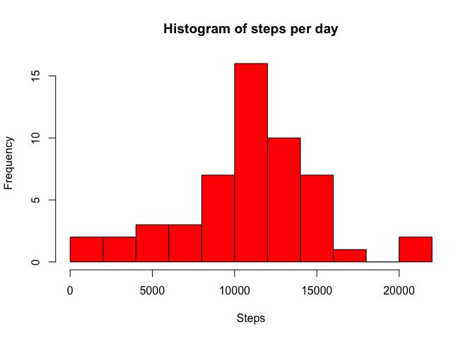
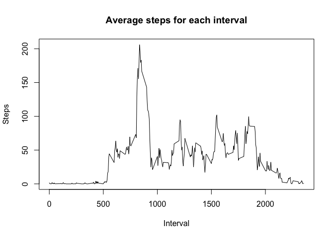
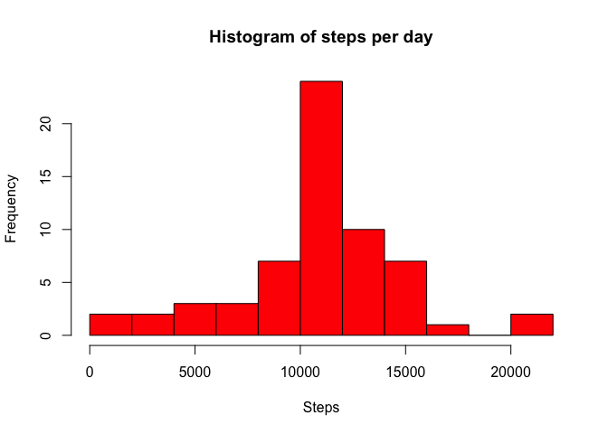
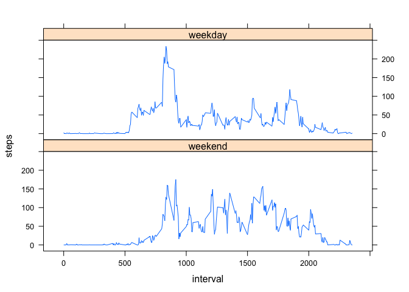

# Reproducible Research: Peer Assessment 1


## Loading and preprocessing the data


```r
library(dplyr)
```

```
## 
## Attaching package: 'dplyr'
## 
## The following objects are masked from 'package:stats':
## 
##     filter, lag
## 
## The following objects are masked from 'package:base':
## 
##     intersect, setdiff, setequal, union
```

```r
df <- read.csv("activity.csv",header = T,na.strings = "NA",
               colClasses = c("integer","Date","integer"))
df <- tbl_df(df)
```

## What is mean total number of steps taken per day?

```r
df1 <- select(df, -interval) %>% group_by(date) %>% summarise(steps = sum(steps))

hist(df1$steps,col="Red",xlab="Steps",breaks = 10,
     main ="Histogram of steps per day")
```

 

```r
#dev.copy(png,"Histogram of steps per day.png")
#dev.off()
summary(df1$steps)
```

```
##    Min. 1st Qu.  Median    Mean 3rd Qu.    Max.    NA's 
##      41    8841   10760   10770   13290   21190       8
```
The mean is 10770, and the median is 10760.

## What is the average daily activity pattern?

```r
df2 <- group_by(df,interval) %>% summarise(steps = mean(steps,na.rm =T))

plot(df2$interval,df2$steps,type='l',xlab="Interval",ylab="Steps",
     main ="Average steps for each interval")
```

 

```r
#dev.copy(png,"Average daily activity pattern.png")
#dev.off()
with(df2,interval[steps == max(steps)])
```

```
## [1] 835
```
The 835-840 interval contains the maximum number of steps.

## Imputing missing values

```r
summary(df)
```

```
##      steps             date               interval     
##  Min.   :  0.00   Min.   :2012-10-01   Min.   :   0.0  
##  1st Qu.:  0.00   1st Qu.:2012-10-16   1st Qu.: 588.8  
##  Median :  0.00   Median :2012-10-31   Median :1177.5  
##  Mean   : 37.38   Mean   :2012-10-31   Mean   :1177.5  
##  3rd Qu.: 12.00   3rd Qu.:2012-11-15   3rd Qu.:1766.2  
##  Max.   :806.00   Max.   :2012-11-30   Max.   :2355.0  
##  NA's   :2304
```
There are 2304 missing values in the dataset.
Use the mean for that 5-minute interval to replace the missing values.

```r
df3 <- mutate(df,mean=sapply(df$interval, function(x) df2$steps[df2$interval==x]))
df3$steps[is.na(df3$steps)] <- df3$mean[is.na(df3$steps)]
```
Compare with part 1:

```r
df3_1 <- select(df3, -interval) %>% group_by(date) %>% summarise(steps = sum(steps))

hist(df3_1$steps,col="Red",xlab="Steps",breaks = 10,
     main ="Histogram of steps per day")
```

 

```r
#dev.copy(png,"Histogram of steps per day (imputed NA).png")
#dev.off()
summary(df3_1$steps)
```

```
##    Min. 1st Qu.  Median    Mean 3rd Qu.    Max. 
##      41    9819   10770   10770   12810   21190
```
The mean is 10770, and the median is 10770. Different from part 1.

Compare with part 2:

```r
df3_2 <- group_by(df3,interval) %>% summarise(steps = mean(steps,na.rm =T))

plot(df3_2$interval,df3_2$steps,type='l',xlab="Interval",ylab="Steps",
     main ="Average steps for each interval")
```

 

```r
#dev.copy(png,"Average daily activity pattern (imputed NA).png")
#dev.off()
with(df3_2,interval[steps == max(steps)])
```

```
## [1] 835
```
No impact on the part 2 results.

## Are there differences in activity patterns between weekdays and weekends?

```r
l_weekdays <- c('Monday', 'Tuesday', 'Wednesday', 'Thursday', 'Friday')
df4 <- mutate(df, weekday = factor((weekdays(df$date) %in% l_weekdays),
                                   levels=c(FALSE, TRUE),
                                   labels=c('weekend', 'weekday'))) %>%
    group_by(weekday,interval) %>% summarise(steps = mean(steps,na.rm =T))

library(lattice)
attach(df4)
xyplot(steps~interval|weekday, type="l",layout=c(1,2))
```

 

```r
#dev.copy(png,"Activity patterns.png")
#dev.off()
```

